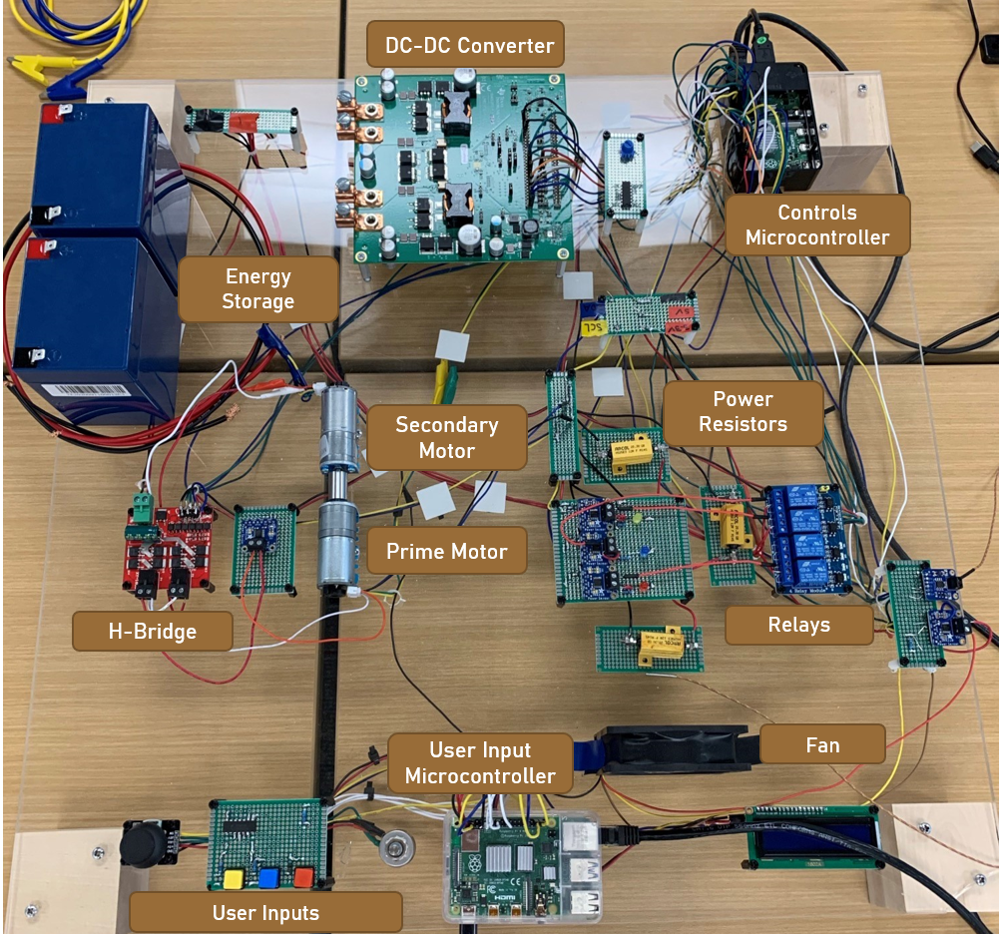
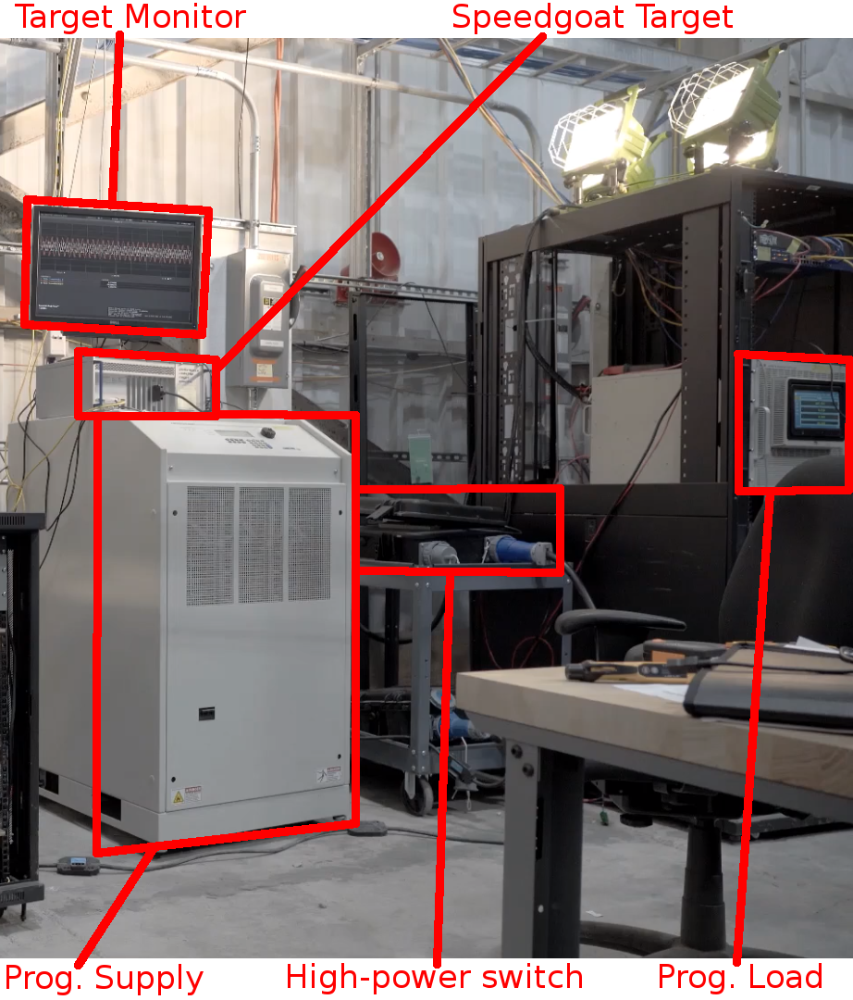
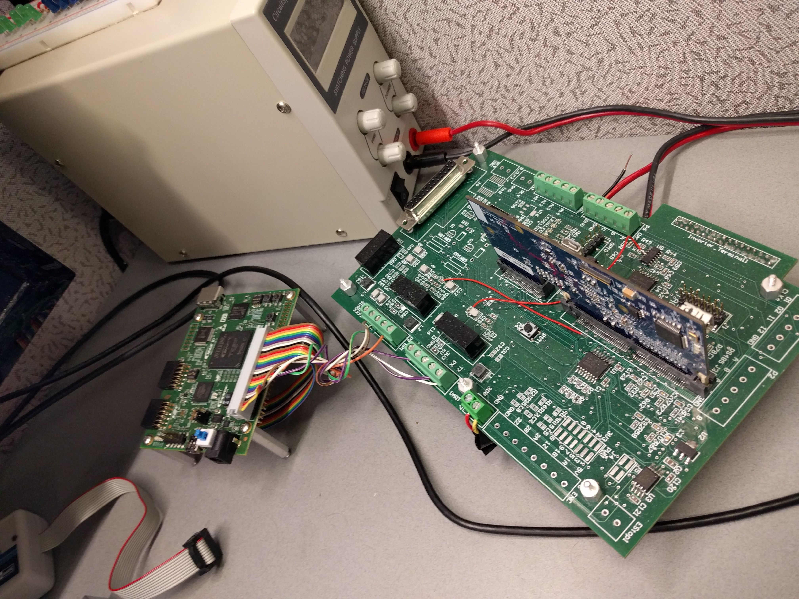
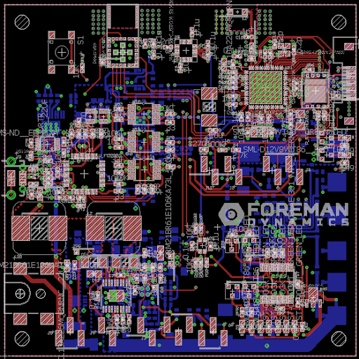
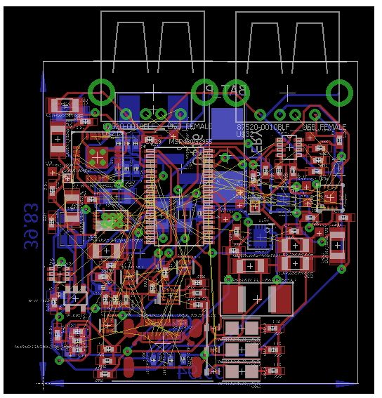
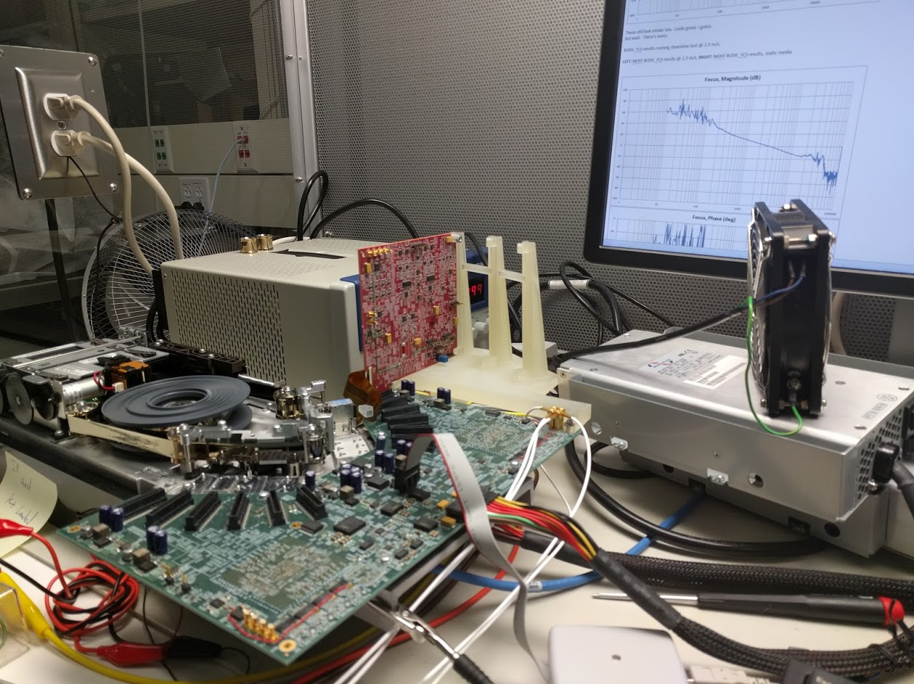

# Hardware Gallery
---

## Electrical Desktop Demonstrator (EDD) as a desktop-scale model of a Naval Shipboard Power System

 
 
 
 
 
 
 
 
 
 
 
 
 
 

## Motor-Generator Load

 
 
 
 
 
 
 
 
 
 
 
 
 
 

## Programmable Dynamic Constant Power Load (Electronic)

 
 
 
 
 
 
 
 
 
 
 
 
 
 

## Cummins 5 kW Tactical Quiet Generator (TQG)

 
 
 
 
 
 
 
 
 
 
 
 
 
 

## Hardware-in-the-Loop (HiL) Real-Time Simulation Set-Up

 
 
 
 
 
 
 
 
 
 
 
 
 
 

## Battery-powered sensor board

 
 
 
 
 
 
 
 
 
 
 
 
 
 

## Untethered power bank, charging mobile devices

 
 
 
 
 
 
 
 
 
 
 
 
 
 

## Optical Tape Drive Prototype

 
 
 
 
 
 
 
 
 
 
 
 
 
 

[Home](./)
