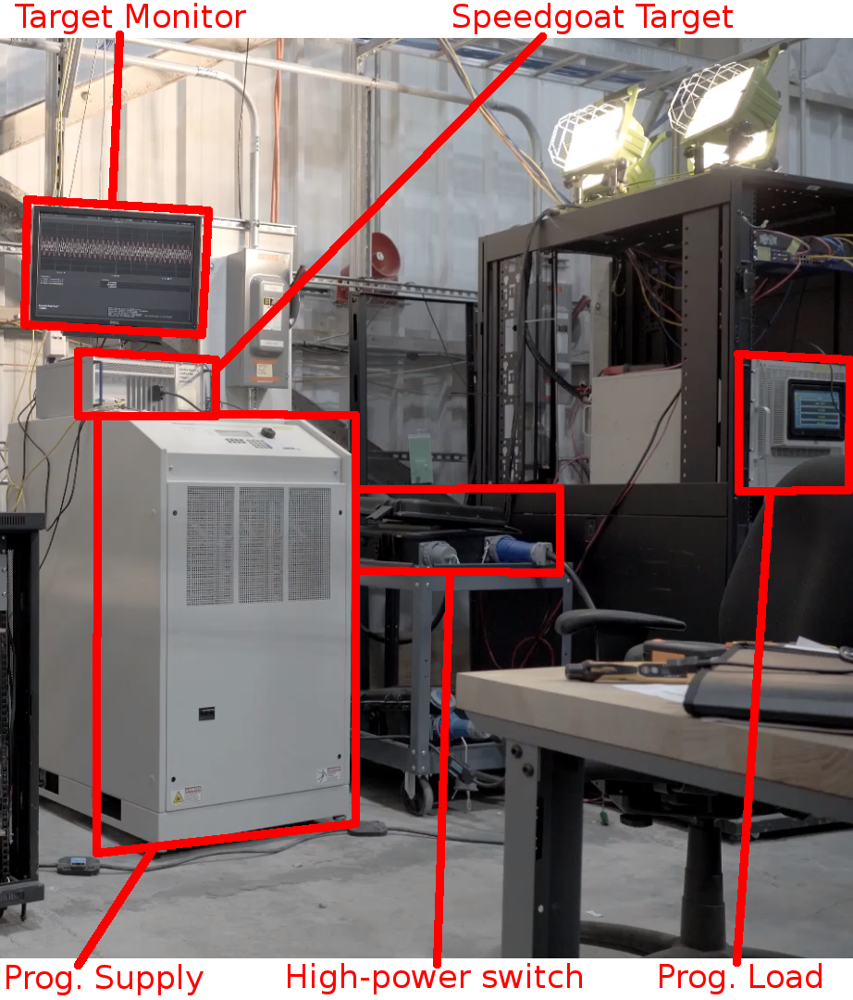
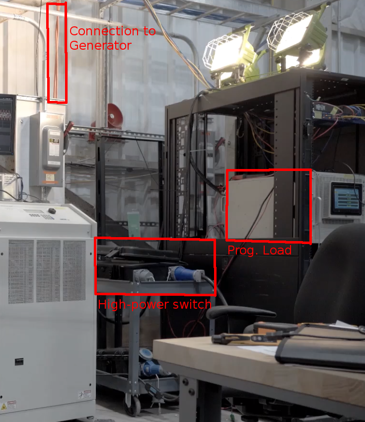
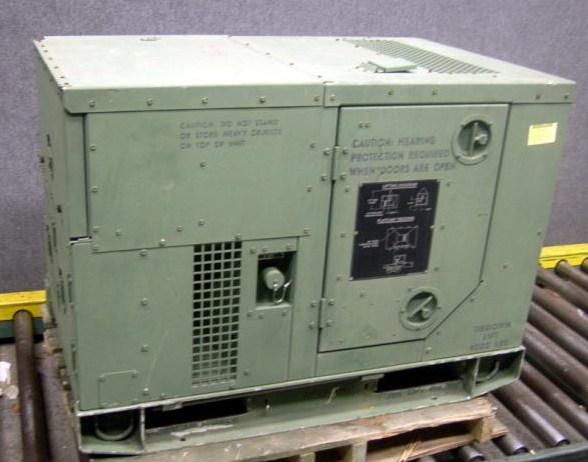

# Power Systems Simulation
---

### Relevant Publications

<!-- HPEC Supercloud, High-performance computing techniques in power systems -->
* **Matthew Overlin**, Christopher Smith.  "High Performance Computing Techniques with Power Systems Simulations," in _IEEE High Performance and Extreme Computing (HPEC)_.  2018.

<!-- FPGA Load flow -->
* **Matthew Overlin**, Colm O'Rourke, Po-Hsu Huang, James Kirtley Jr., "A Timing Comparison of Different FPGA-Accelerated Load Flow Solvers," _IEEE Innovative Smart Grid Technologies (ISGT) Brazil_.  2019.

<!-- SM, network, DAE's, WECC 9-bus network. -->
* **Matthew Overlin**, Marc Barbar, Krishnan Kant, Christopher Smith, James Kirtley Jr., "An Enhanced Time-Domain Simulator of Transient Stability in Power Systems," _IEEE PowerAfrica Conference_.  2019.

<!-- Geometric DQ0 transformations, Colm O'Rourke -->
* Colm O'Rourke, Mohammad M. Qasim, **Matthew Overlin**, James Kirtley Jr., "A Geometric Interpretation of Reference Frames and Transformations: dq0, Clarke and Park," _IEEE Transactions on Energy Conversion_.  2019.

# Parameter Estimation with Devices in Microgrids
---

<!--  -->
<!--  -->

As part of my PhD research, I developed a hybrid algorithm for parameter estimation (HAPE) which is used to estimate the parameters in simulaiton models for dynamic constant power loads (DCPLs) and diesel generator sets. 

### Relevant Publications

<!-- IEEE Transactions on Industrial Electronics, Load Identification -->
* **Matthew Overlin**, Christopher Smith, James L. Kirtley Jr.  "A Hybrid Algorithm for Parameter Estimation (HAPE) for Dynamic Constant Power Loads," in _IEEE Transactions on Industrial Electronics_.  2020.

<!-- IEEE Transactions on Energy Conversion, TQG diesel genset parameter estimation. -->
* [Accepted] **Matthew Overlin**, James Macomber, Christopher Smith, Luca Daniel, Edward Corbett, James L. Kirtley Jr.  "A Hybrid Algorithm for Parameter Estimation (HAPE) for Diesel Generator Sets," in _IEEE Transactions on Energy Conversion_.  2022.

# Reconfigurability and System Stability in Microgrids
---

### Relevant Publications

<!-- Paper from Xia, SM PHiL work -->
* Xia Miao, Marija Ilic, Christopher Smith, **Matthew Overlin**, Ryan Wiechens.  "Toward Distributed Control for Reconfigurable Robust Microgrids," in _IEEE Energy Conversion Congress and Exposition (ECCE)_.  2020.

<!-- IEEE Transactions on Power Delivery, Solar APF paper. -->
* [Submitted] **Matthew Overlin**, James Macomber, Christopher Smith, Luca Daniel, Edward Corbett, James L. Kirtley Jr.  "Parameter Selection for Harmonic Mitigation in Rooftop Photovoltaic Systems," in _IEEE Transactions on Power Delivery_.  2021.

# Power Electronics
---

### Relevant Publications

<!-- APEC Load Identification -->
* **Matthew Overlin**, Christopher Smith, Marija Ilic, James L. Kirtley Jr.  "A Workflow for Non-linear Load Parameter Estimation using a Power-Hardware-in-the-Loop Experimental Testbed," in _Applied Power Electronics Conference (APEC)_.  2020.

<!-- APEC multi-functional AC-AC converter -->
* Krishan Kant, **Matthew Overlin**, Lukasz Huchel, Mohammad Qasim, James L. Kirtley Jr..  "Self Synchronizing Controller for a Multifunctional Single Phase AC-DC-AC Converter," in _Applied Power Electronics Conference (APEC)_.  2020.

[Home](./)
