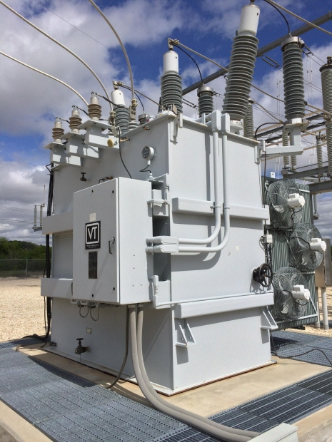

## Parameter Estimation for Dynamic Constant Power Loads
---

t's up to the mobile-specific style sheets to adapt. They could either not honor the request to float, or they could resize the image to 30% width so that it looks OK on mobile... either way, it's not the poster's problem to decide how to format for small screen, it's our job. All I'm suggesting is some minor syntax that indicates a hint by the poster that a particular image is a decoration, not a part of the narrative, which we choose to interpret using float:right in the normal web view. – 
Joel Spolsky
Staff
Mod
 Jul 23 '11 at 19:36
As far as markdown is concerned, that is a smart thing to think about now, and it's good that you brought it up. Maybe we can come up with a syntactic notation that, if ignored, does no damage. For example we could use > - any markdown processor that didn't understand the special rule for >! would just show the image indented, which is relatively harmless. – 
Joel Spolsky
Staff
Mod
 Jul 23 '11 at 19:40
Actually, @Joel, on a small screen the image should kind of be made taller to fit the same amount of text next to the image ;-) (A paragraph of text often takes more lines on smaller screens.) A syntax with fallback, just

t's up to the mobile-specific style sheets to adapt. They could either not honor the request to float, or they could resize the image to 30% width so that it looks OK on mobile... either way, it's not the poster's problem to decide how to format for small screen, it's our job. All I'm suggesting is some minor syntax that indicates a hint by the poster that a particular image is a decoration, not a part of the narrative, which we choose to interpret using float:right in the normal web view. – 
Joel Spolsky
Staff
Mod
 Jul 23 '11 at 19:36
As far as markdown is concerned, that is a smart thing to think about now, and it's good that you brought it up. Maybe we can come up with a syntactic notation that, if ignored, does no damage. For example we could use > - any markdown processor that didn't understand the special rule for >! would just show the image indented, which is relatively harmless. – 
Joel Spolsky
Staff
Mod
 Jul 23 '11 at 19:40
Actually, @Joel, on a small screen the image should kind of be made taller to fit the same amount of text next to the image ;-) (A paragraph of text often takes more lines on smaller screens.) A syntax with fallback, just

[Home](./)
